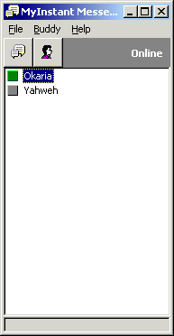



## Build Your Own Instant Messenger

### Description

[UPDATED: April 02, 2000] One of the questions I get asked most is "Hey Evan, any idea on how I can make my own ICQ?". I have recently been spending a lot of my time building just such a thing in Visual Basic 6, so I thought I would share the knowledge I have attained. This is, to my knowledge, the first tutorial available on the web for making an instant messenger of this kind in VB6. I am not going to go into great detail on how to use the code here. Instead, go to this tutorial's webpage at http://pfh.uo2station.com/docs/vb6_makeicq.html 

----

[June 12, 2001: Major update coming soon! Keep an eye on this page.]
 
### More Info
 

             |
---                |---
**Submitted On**   |2000-03-10 01:37:34
**By**             |[Evan C\. Sims](https://github.com/Planet-Source-Code/PSCIndex/blob/master/ByAuthor/evan-c-sims.md)
**Level**          |Intermediate
**User Rating**    |4.9 (118 globes from 24 users)
**Compatibility**  |VB 5\.0, VB 6\.0
**Category**       |[Internet/ HTML](https://github.com/Planet-Source-Code/PSCIndex/blob/master/ByCategory/internet-html__1-34.md)
**World**          |[Visual Basic](https://github.com/Planet-Source-Code/PSCIndex/blob/master/ByWorld/visual-basic.md)
**Archive File**   |[CODE\_UPLOAD39113102000\.zip](https://github.com/Planet-Source-Code/evan-c-sims-build-your-own-instant-messenger__1-6520/archive/master.zip)

